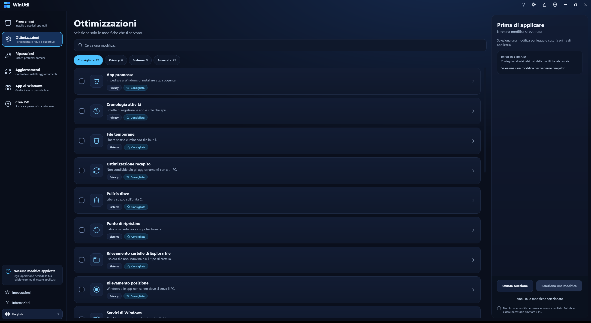
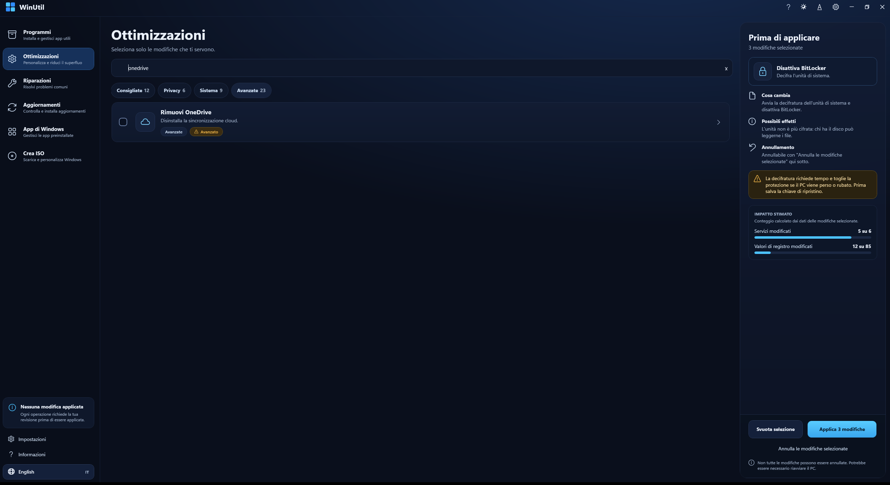
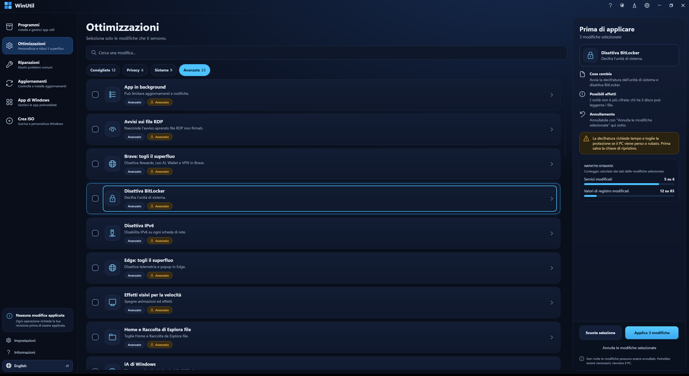
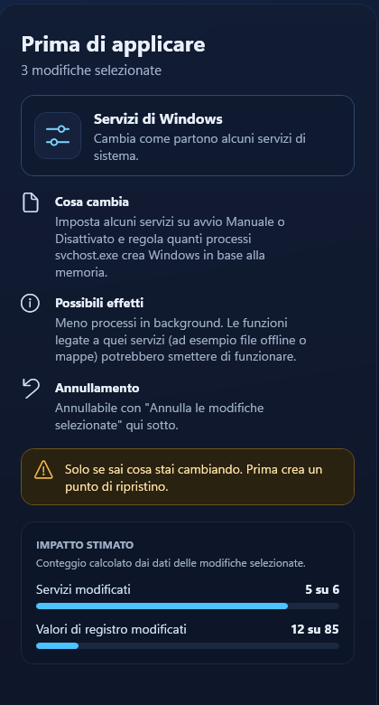
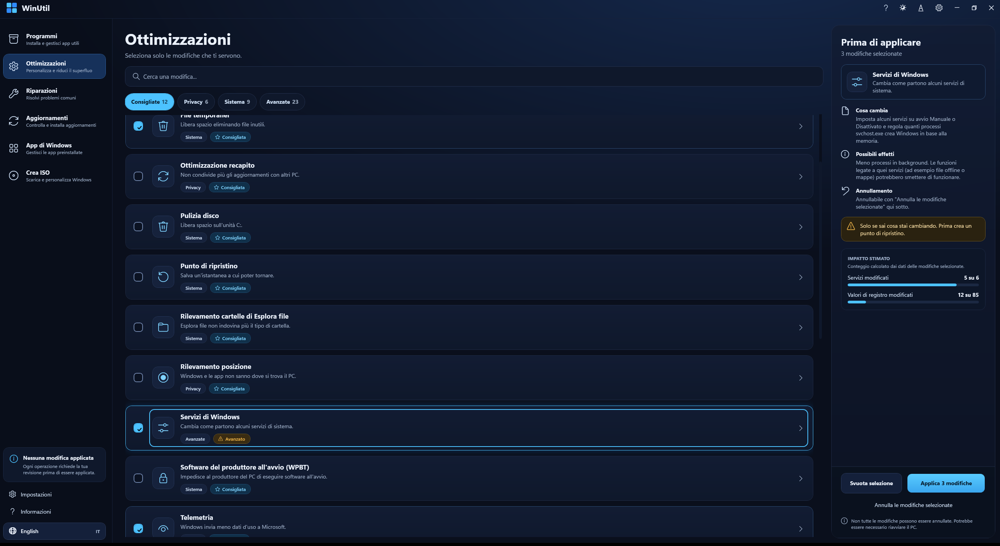
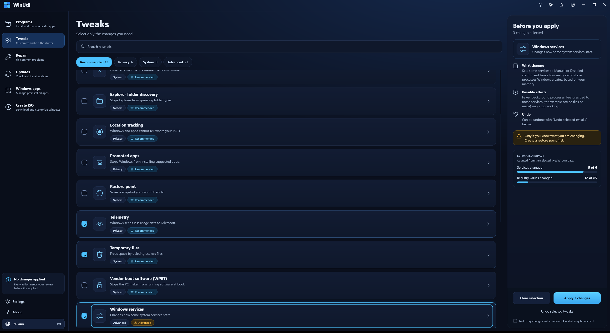
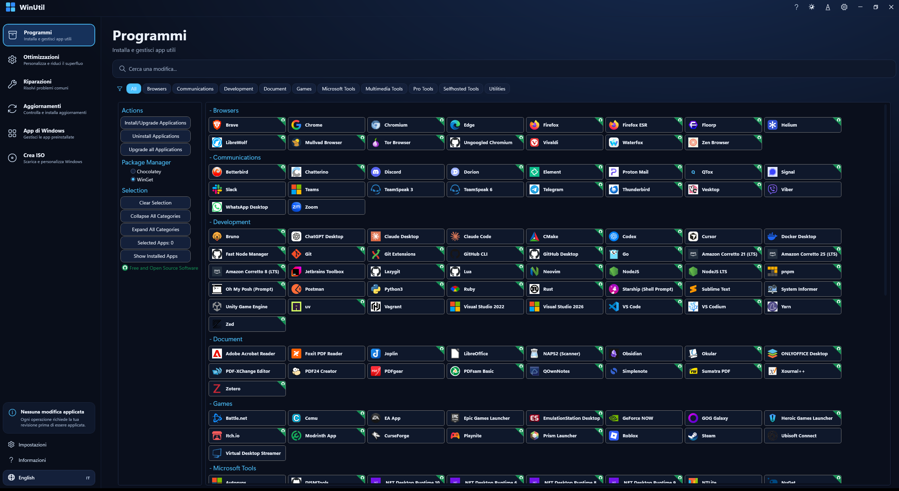

# WinUtil – interfaccia ridisegnata (fork personale)

[English](README.md) | **Italiano**

Questo è un fork personale di [ChrisTitusTech/winutil](https://github.com/ChrisTitusTech/winutil) con un'interfaccia ridisegnata, opzionale. **Non** è il progetto ufficiale e non è affiliato ad esso. Le ottimizzazioni, le installazioni e gli aggiornamenti usano ancora il motore di upstream: la logica non è stata cambiata.

> **Stato:** l'interfaccia gira come programma vero (avviata con il comando qui sotto su Windows 11: aperte tutte le schede, selezionate delle card, usati filtri, ricerca e lingua), ma **con essa non è stata ancora applicata né annullata nessuna ottimizzazione**. Quella parte, e il pannello di avanzamento durante un job vero, non è provata. Leggi [Stato del progetto](#stato-del-progetto) prima di usarla.

## Cos'è questo fork e perché esiste

WinUtil è potente, ma la finestra predefinita è un lungo elenco di caselle con nomi asciutti. Questo fork aggiunge una seconda interfaccia, pensata per essere più leggibile e più sicura per chi è alle prime armi con questo tipo di strumento:

- Un'interfaccia scura e moderna con barra laterale, ricerca, filtri e schede.
- Ogni ottimizzazione spiegata in parole semplici: cosa cambia, cosa può andare storto e se si può annullare.
- Un'anteprima prima di applicare: cosa tocca ogni modifica, contato dai dati dell'ottimizzazione stessa.
- Avanzamento visibile mentre le modifiche vengono applicate.
- Italiano e inglese, selezionabili dalla barra laterale.
- Nella nuova finestra e nella scheda Ottimizzazioni: testi che seguono lo scaling dei caratteri di WinUtil (Ctrl +/-), controlli di almeno 44 px, focus da tastiera visibile e contrasto del testo di almeno 4,5:1. Le schede che mantengono il layout di upstream mantengono le sue dimensioni.

È un fork compatibile con upstream. L'interfaccia originale c'è ancora (è la build predefinita) e il ridisegno è opzionale. I file di upstream sono stati lasciati intatti per quanto possibile, così integrare gli aggiornamenti di upstream resta semplice. **La logica di ottimizzazioni, installazione delle app e aggiornamenti non è stata cambiata**: il ridisegno aggiunge solo una nuova finestra, gli stili e il codice che la riempie.

## Cosa è migliorato

> Gli screenshot sono del programma vero, fatti su Windows 11 con la finestra a schermo intero, in italiano (la lingua del PC su cui sono stati fatti) salvo dove indicato. Manca solo quello dell'avanzamento: mostrarlo significa applicare davvero un'ottimizzazione.

### Barra laterale e navigazione
Un solo posto per spostarsi tra Programmi, Ottimizzazioni, Riparazioni, Aggiornamenti, App di Windows e Crea ISO, ognuno con una riga di descrizione, più una scheda di stato, Impostazioni, Informazioni e il pulsante della lingua. Sono le stesse schede di upstream (Riparazioni è la scheda Config di upstream).



### Filtri e ricerca
Quattro filtri con contatore (Consigliate, Privacy, Sistema, Avanzate) e un campo di ricerca che guarda tutte le ottimizzazioni per nome e descrizione, nella lingua scelta.



### Schede con etichette di sicurezza
Ogni ottimizzazione è una scheda con casella, icona, nome e descrizione in parole semplici ed etichette: la categoria più *Consigliata*, *Sicura* o *Avanzato*. *Consigliata* significa che l'ottimizzazione è nel preset Standard di upstream; *Avanzato* significa che è nella categoria "CAUTION" di upstream (per esempio rimuovere Edge, OneDrive o i componenti IA di Windows) oppure che è una modifica rischiosa di per sé: servizi, rimozione dei Widget, disattivare BitLocker.



### Pannello "Prima di applicare"
Clicca una scheda per vedere, a destra: cosa cambia, i possibili effetti, se si può annullare e un avviso quando c'è. Se un'ottimizzazione si può annullare lo si legge dai suoi dati (uno script di annullamento, un valore di registro originale o un tipo di servizio originale), non è scritto a mano.



### Impatto stimato
Per le ottimizzazioni selezionate, quanti servizi e quanti valori di registro toccano, rispetto a tutto ciò che toccano le schede. Una barra compare solo se la selezione ha quel tipo di dato. Non ci sono valori per memoria, spazio su disco o punteggio privacy perché il repository non ha dati per questi e nessuno è inventato.



### Avanzamento
Mentre le ottimizzazioni vengono applicate, il pannello mostra il passo reale del motore e una percentuale, poi un pulsante "Nuova selezione" alla fine. Il nome del passo è quello riportato dal motore (usa ancora il nome interno dell'ottimizzazione).

> 📷 *Screenshot non disponibile: mostrare il pannello di avanzamento significa applicare davvero un'ottimizzazione, cosa che non è stata fatta per scattare le immagini.*

### Cambio lingua
Italiano o inglese dalla barra laterale. Tutte le etichette, descrizioni, avvisi e passi del ridisegno arrivano da un unico dizionario, [`ui/redesign/strings.json`](ui/redesign/strings.json). Parte nella lingua di visualizzazione di Windows.



### Cosa non è stato ridisegnato
Solo la scheda Ottimizzazioni ha il nuovo layout a schede. Programmi, Riparazioni, Aggiornamenti, App di Windows e Crea ISO mantengono il layout di upstream dentro la nuova finestra e barra laterale, con la nuova palette scura. Interruttori, pulsanti e l'elenco Multiplane Overlay si applicano subito, come in upstream, e compaiono sotto "Altre impostazioni"; l'elenco DNS si applica con il pulsante Applica.



## Installazione e avvio

Apri PowerShell ed esegui, come il comando di upstream (WinUtil chiede di rilanciarsi come Amministratore):

```powershell
irm https://github.com/realfulvio/winutil/releases/latest/download/winutil.ps1 | iex
```

Scarica l'ultima build dell'interfaccia ridisegnata di questo fork (pubblicata dal workflow [Release redesigned interface](.github/workflows/redesign-release.yaml)) e, quando si rilancia come Amministratore, riscarica la stessa build, non quella di upstream.

Per compilarla da sé (Windows con PowerShell e Git):

```powershell
git clone https://github.com/realfulvio/winutil.git
cd winutil
.\Compile.ps1 -Interface Redesign -Run
```

`Compile.ps1` costruisce `winutil.ps1` dai sorgenti (il file è generato e non viene committato). Se PowerShell rifiuta di eseguirlo, consenti gli script solo per questa finestra con `Set-ExecutionPolicy -Scope Process -ExecutionPolicy Bypass` e riprova. Una build fatta così si rilancia dall'indirizzo di `-ReleaseUrl` (per impostazione predefinita l'ultima release del fork).

## Tornare all'interfaccia originale

Il ridisegno è opzionale. Usa il comando ufficiale, oppure compila senza l'opzione:

```powershell
.\Compile.ps1 -Run
```

```powershell
irm https://christitus.com/win | iex
```

## Avvertenza

**Le ottimizzazioni modificano il sistema**: il registro, i servizi, i componenti installati e, per alcune, il funzionamento di dischi e rete. Non tutte si possono annullare e alcune richiedono un riavvio. Crea un **punto di ripristino** prima di applicare qualsiasi cosa (la modifica *Punto di ripristino* lo fa) e leggi ogni descrizione. **L'uso è a tuo rischio**; il software è fornito così com'è, senza garanzia.

## Stato del progetto

Cosa è stato controllato (su una macchina Windows 11, senza applicare nessuna ottimizzazione):

- Il comando pubblicato (`irm … | iex`) avvia l'interfaccia ridisegnata, compreso il rilancio come Amministratore dalla release di questo fork. Tutte le schede si aprono; le card si selezionano e vanno a fuoco; filtri, ricerca, cambio lingua, ingrandimento e chiusura funzionano, e il log del programma non mostra avvisi né errori.
- `Compile.ps1` compila entrambe le varianti; la build predefinita è identica, byte per byte, a quella di `main`.
- Lo script generato passa il parser di PowerShell 7 e di Windows PowerShell 5.1 ed è solo ASCII.
- Sui runner Windows di GitHub tutta la suite Pester passa (874 test, compresi quelli di questo fork) e il workflow di build compila e pubblica la release.
- La finestra si carica con tutti i controlli di quella di upstream ancora presenti e la logica della scheda è stata eseguita su dati simulati: le 38 schede, selezione, filtri, ricerca, lingua, stato del pulsante Applica, valori di impatto, stati del pannello di avanzamento e scaling dei caratteri.

`ui/redesign/tools/Test-RedesignHeadless.ps1` ripete i controlli in memoria su qualsiasi macchina Windows, senza avviare WinUtil e senza cambiare nulla.

Cosa non è stato controllato: applicare un'ottimizzazione e annullarla con questa interfaccia, il pannello di avanzamento durante un job vero, una macchina che non sia Windows 11 o non sia in italiano o inglese, e la build del sito della documentazione. Script Analyzer gira nella CI del repository e segnala nei file del ridisegno dei punti che sono convenzioni accettate di questo repository (nomi plurali, ShouldProcess sugli helper UI). Dettagli e decisioni sono in [`NOTE-LAVORO.md`](NOTE-LAVORO.md).

## Crediti e licenza

Tutto il motore, le ottimizzazioni, l'elenco delle app e l'interfaccia originale sono opera di **[Chris Titus Tech](https://github.com/ChrisTitusTech)** e dei collaboratori di [ChrisTitusTech/winutil](https://github.com/ChrisTitusTech/winutil); vedi i suoi [collaboratori](https://github.com/ChrisTitusTech/winutil/graphs/contributors) e la [documentazione ufficiale](https://winutil.christitus.com/). Questo fork mantiene la licenza di upstream: [MIT](LICENSE), copyright (c) 2022 CT Tech Group LLC. Il ridisegno aggiunge file sotto `ui/redesign/` e l'opzione `-Interface` in `Compile.ps1`.

## Il progetto upstream

Il [README originale](README.md#about-the-upstream-project) (in inglese) è conservato in fondo al [README in inglese](README.md): i suoi comandi avviano WinUtil ufficiale, non modificato. Sponsor e collaboratori di upstream sono elencati lì.
